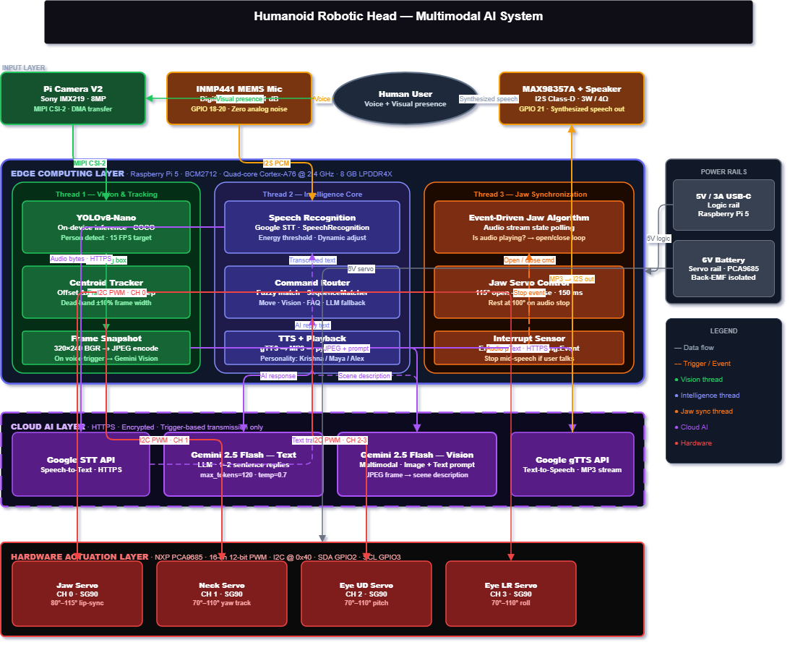

# Interactive Humanoid Robotic Head — NIT Jamshedpur

**Developer:** Ranjeet Gupta
**Mentor:** Dr. Vijay Kumar Dalla
**Institution:** National Institute of Technology, Jamshedpur

---

## Project Overview

A standalone, cost-effective humanoid robotic head powered by multimodal AI.
It combines on-device computer vision (YOLOv8-Nano) with cloud-based language
intelligence (Google Gemini 2.5 Flash) to achieve:

- Real-time person tracking via neck servo
- Natural voice conversation with jaw-sync lip animation
- Human-interrupt detection — robot stops mid-sentence when you speak
- Multimodal queries — "What do you see?" sends a live camera frame to Gemini
- Multiple personalities (Krishna / Maya / Alex) with different TTS accents

---
## System Architecture

---

## Project Structure

```
humanoid_robot/
├── main.py                        ← Entry point
├── config.py                      ← All tuneable parameters (edit here first)
├── requirements.txt
├── setup.sh                       ← One-shot Raspberry Pi setup
├── test_hardware.py               ← Verify servos, mic, camera, speaker, API
│
├── modules/
│   ├── servo_controller.py        ← PCA9685 I2C PWM servo driver
│   ├── audio_manager.py           ← gTTS + pygame playback + beep
│   ├── speech_engine.py           ← Google STT + interrupt sensor
│   ├── ai_brain.py                ← Gemini text + vision queries
│   ├── vision_tracker.py          ← YOLOv8 person tracking thread
│   └── robot_controller.py        ← Main loop, command router, speak()
│
└── utils/
    └── logger.py                  ← Centralised timestamped logging
```

---

## Hardware Requirements

| Component | Part | Interface |
|---|---|---|
| SBC | Raspberry Pi 5 (8 GB) | — |
| Servo driver | NXP PCA9685 (16-ch PWM) | I2C @ 0x40 |
| Camera | Pi Camera Module V2 (Sony IMX219) | MIPI CSI-2 |
| Microphone | INMP441 Digital MEMS | I2S |
| Amplifier | Adafruit MAX98357A Class-D | I2S |
| Speaker | 4 Ω / 3 W | — |
| Servos (×4) | SG90 or similar | PCA9685 CH 0–3 |
| Logic power | 5 V / 3 A USB-C | — |
| Servo power | 6 V external battery | PCA9685 V+ |

### Wiring Summary

```
PCA9685  →  Raspberry Pi 5
  VCC    →  5 V   (Pin 2 / 4)
  GND    →  GND   (Pin 6)
  SDA    →  GPIO 2  (Pin 3)
  SCL    →  GPIO 3  (Pin 5)
  V+     →  External 6 V battery (+)
  GND    →  External 6 V battery (-)

PCA9685 Channels:
  CH 0   →  Jaw servo
  CH 1   →  Neck servo  (left / right)
  CH 2   →  Eye Up/Down servo
  CH 3   →  Eye Left/Right servo

I2S Microphone (INMP441):
  VDD  → 3.3 V (Pin 1)
  GND  → GND   (Pin 9)
  SD   → GPIO 20 (PCM_DIN)
  WS   → GPIO 19 (PCM_FS)
  SCK  → GPIO 18 (PCM_CLK)
  L/R  → GND (left channel)

I2S Amplifier (MAX98357A):
  VIN  → 5 V
  GND  → GND
  DIN  → GPIO 21 (PCM_DOUT)
  BCLK → GPIO 18 (PCM_CLK)
  LRC  → GPIO 19 (PCM_FS)
```

---

## Installation

### 1. Run setup script (Raspberry Pi only)

```bash
chmod +x setup.sh
./setup.sh
sudo reboot
```

### 2. Set your Gemini API key

```bash
export GEMINI_API_KEY="your-key-here"
# Or add it permanently:
echo 'export GEMINI_API_KEY="your-key-here"' >> ~/.bashrc
source ~/.bashrc
```

### 3. Verify hardware

```bash
# Confirm PCA9685 on I2C bus
sudo i2cdetect -y 1     # expect address 0x40

# Run full hardware test
python3 test_hardware.py
```

### 4. Start the robot

```bash
python3 main.py
```

---

## Voice Commands

### Movement
| Say | Action |
|---|---|
| "Look left" / "Turn left" | Neck + eyes left |
| "Look right" / "Turn right" | Neck + eyes right |
| "Look up" | Eyes up |
| "Look down" | Eyes down |
| "Look straight" / "Center" / "Reset" | All servos to neutral |

### Vision
| Say | Action |
|---|---|
| "What do you see?" | Captures frame → Gemini describes it |
| "Start tracking" / "Track me" | Begins face-tracking loop |
| "Stop tracking" | Pauses tracking |

### Personality
| Say | Switches to |
|---|---|
| "Change to Krishna" | Indian English accent |
| "Change to Maya" | British English accent |
| "Change to Alex" | Australian English accent |

### General
- Ask anything — Gemini answers in 1-2 sentences
- Say "Goodbye" / "Exit" / "Quit" to shut down

---

## Configuration

All parameters are in `config.py`. Key values:

```python
# Servo angles — adjust if your servos are mounted differently
Config.JAW_OPEN   = 115   # degrees
Config.JAW_CLOSED = 80
Config.NECK_LEFT  = 70
Config.NECK_RIGHT = 110

# Interrupt sensitivity (lower = more sensitive)
Config.INTERRUPT_ENERGY = 1000

# Max AI response length (characters)
Config.MAX_RESPONSE_CHARS = 200

# Vision tracking FPS
Config.TRACK_FPS_TARGET = 15.0
```

---

## Troubleshooting

### PCA9685 not detected
```bash
sudo i2cdetect -y 1
# If nothing shows at 0x40:
# - Check SDA → GPIO 2, SCL → GPIO 3
# - Confirm 5V VCC and GND connected
# - Ensure I2C is enabled: sudo raspi-config → Interface Options → I2C
```

### No audio output
```bash
speaker-test -t wav -c 2
aplay -l      # list devices
```

### Poor speech recognition
- Move closer to the INMP441 microphone
- Reduce ENERGY_THRESHOLD in config.py
- Check for electrical noise near the mic (move away from servo power lines)

### Robot not stopping when you speak (interrupt)
- Lower `Config.INTERRUPT_ENERGY` (try 600–800)
- Ensure the microphone is working independently

---

## Auto-start on Boot

The setup script creates an optional systemd service:

```bash
sudo systemctl start humanoid-robot    # start now
sudo systemctl status humanoid-robot   # check status
journalctl -u humanoid-robot -f        # live logs
```

---

## Log File

Logs are written to `/home/ranjeet/robot.log` and also printed to console.
Change `Config.LOG_FILE = ""` to disable file logging.

---

## References

- Huang et al. (2026). ECO: Energy-constrained optimization. IEEE TASE.
- Liu et al. (2025). Neural brain: A neuroscience-inspired framework. arXiv:2505.07634
- Redmon et al. (2016). You Only Look Once. CVPR.
- Google DeepMind (2023). Gemini: A family of multimodal models.
